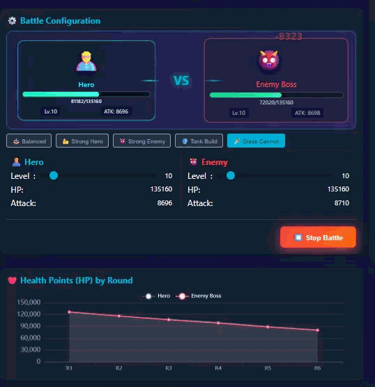

<div align="center">

# SoonFx 运行时

> SoonFx：TypeScript 优先的 RPG 和策略游戏数值引擎。
  此 GitHub 项目托管了使用 [SoonFx 编辑器](https://github.com/soonfx-engine/editor) 数据所需的 SoonFx 编辑器运行时。

[](https://www.npmjs.com/package/@soonfx/engine)
[](https://www.npmjs.com/package/@soonfx/engine)
[](https://github.com/soonfx-engine/core/actions/workflows/ci.yml)
[](https://opensource.org/licenses/Apache-2.0)
[](https://www.typescriptlang.org/)

**基于TypeScript开发的 游戏数值计算和公式系统**

此 GitHub 项目托管了使用 [SoonFx 编辑器](https://github.com/soonfx-engine/editor) 数据所需的 SoonFx 编辑器运行时。

[安装](#-安装) · [快速开始](#-快速开始) · [文档](#-核心-api) · [示例项目](examples) · [路线图](ROADMAP.md) · [在线演示](https://soonfx.dev)

[English](README.md) | [简体中文](README.zh-CN.md)

</div>

---

## 📸 演示

### [SoonFx 编辑器](https://github.com/soonfx-engine/editor)


### [运行时演示](https://soonfx.dev/)

 


## ✨ 核心特性

- 🎯 **TypeScript 支持** - 类型定义，智能提示和类型检查
- 🧮 **数学运算库** - 何计算等数学工具
- 📐 **表达式解析引擎** - 支持复杂的数学表达式求值和 RPN 转换
- 🎮 **游戏数值系统** - 专为游戏开发设计的角色属性、战斗计算等 
- 🔧 **灵活的运算体系统** - 支持复杂的游戏逻辑和公式组合
- 📦 **零依赖** - 轻量级设计，无外部依赖 

## 🚀 面向用户

在您的项目中使用本库：

```bash
npm install @soonfx/engine
```

## 📦 开发环境设置

克隆并设置开发环境：

```bash
# 克隆仓库
git clone https://github.com/soonfx-engine/core.git
cd core

# 安装依赖
npm install

# 构建项目
npm run build

# 运行示例
cd examples
npm install
npm run dev
```

## 🎯 快速开始

### 基础使用

```typescript
import { fx } from '@soonfx/engine';
 

// 1. 使用数学工具函数
const distance = fx.distance(0, 0, 10, 10);
console.log('两点之间的距离:', distance); // 14.142135623730951

// 2. 表达式计算
const result = fx.evaluateExpression('(2 + 3) * 4');
console.log('表达式结果:', result); // 20

// 3. 数值处理
const fixed = fx.fixedDecimal(3.14159, 2);
console.log('保留两位小数:', fixed); // 3.14
```
 

### 事件系统

```typescript
import { Eve, Call, CallCenter } from '@soonfx/engine';

// 创建事件调用中心
const callCenter = new CallCenter();

// 监听事件
callCenter.addEventListener(Eve.SHIFT_ADD_BOARD, (data) => {
    console.log('看板添加事件触发:', data);
});

// 发送事件
Call.send(Eve.ADD_DATABASE_DATA, [data, body, index]);
```

## 📚 核心 API

### 数学工具 (fx)

#### 向量与几何运算
```typescript
// 计算两点之间的距离
const distance = fx.distance(x1, y1, x2, y2);

// 向量点积
const dotProduct = fx.dot(p1x, p1y, p2x, p2y);

// 向量叉积
const crossProduct = fx.cross(p1x, p1y, p2x, p2y);

// 计算向量长度
const length = fx.length(a, b);

// 坐标转换
const coord = fx.coordinate(x, y, angle, distance);
```
 

### 游戏角色 (Player)

`Player` 类提供角色属性、战斗计算和战斗模拟功能。完整的战斗系统演示请参见下方的 [示例项目](#-角色属性战斗数值示例) 部分。
 

## 🏗️ 系统架构

```
@soonfx/fx
├── 核心系统 (core/)
│   ├── EventManager      事件管理器
│   ├── System            系统基类
│   └── Types             类型定义
│
├── 数学运算模块
│   ├── Vector            向量运算 (dot, cross, distance)
│   ├── Numeric           数值处理 (fixedDecimal, currencyConversion)
│   └── Geometry          几何计算 (coordinate, length)
│
├── 表达式系统
│   ├── Parser            表达式解析器
│   ├── RPN Converter     逆波兰表达式转换
│   └── Evaluator         求值引擎
│
├── 数据管理 (data/)
│   ├── Layers            图层系统
│   ├── Metadata          元数据管理
│   ├── Models            数据模型
│   └── Storage           存储系统
│
├── 游戏系统 (game/)
│   ├── FXCentre          游戏引擎核心
│   ├── Player            玩家角色系统
│   └── Formulas          公式计算系统
│
├── 通信系统 (communication/)
│   ├── Events            事件系统
│   ├── Call              事件调用
│   └── Message           消息传递
│
└── 工具函数 (utils/)
    └── ExtendsUtil       扩展工具
```

## 💡 使用场景

### 适用于以下游戏类型：

- 🎲 **回合制游戏** - 复杂的数值计算和战斗系统
- ⚔️ **角色扮演游戏 (RPG)** - 角色属性、技能、装备系统
- 🏆 **策略游戏** - 数值平衡和公式系统
- 🎮 **卡牌游戏** - 卡牌属性计算和效果系统
- 📊 **模拟经营游戏** - 复杂的数值模拟和计算

### 主要应用：

- ✅ 角色属性计算（攻击、防御、生命值等）
- ✅ 战斗伤害计算和战斗模拟
- ✅ 装备和道具效果计算
- ✅ 技能和 Buff 系统
- ✅ 等级和经验系统
- ✅ 游戏数值平衡测试

## 📖 角色属性、战斗数值示例

查看 [示例项目](https://github.com/soonfx-engine/core/tree/main/examples) 获取完整的开发示例。

### 示例内容：

- ⚔️ 战斗系统模拟
- 📊 角色属性计算
- 🎯 PVE 数据生成
- 📈 多场战斗对比分析
- 🎮 完整的游戏数值系统演示

### 本地运行示例：

查看贡献部分的 [快速开始](#快速开始) 了解设置说明。

## 🛠️ TypeScript 支持

SoonFX 提供完整的 TypeScript 类型定义：

```typescript
// 自动类型推导
const distance: number = fx.distance(0, 0, 10, 10);
 

// 完整的智能提示
fx. // IDE 会显示所有可用方法
```

### 类型定义特性：

- ✅ 完整的 TypeScript 类型定义 (.d.ts)
- ✅ 智能代码补全
- ✅ 类型检查和错误提示
- ✅ 参数类型推导
- ✅ 返回值类型推导

## 🔧 浏览器和环境支持

### 支持的环境

- ✅ **Node.js** >= 14.0.0
- ✅ **现代浏览器** (支持 ES2015+)
  - Chrome、Firefox、Safari、Edge（最新版本）
- ✅ **构建工具**
  - esbuild（推荐，项目使用）
  - Webpack、Vite、Rollup 等现代打包工具

### 模块系统

- ✅ **ESM** (ES Modules) - 推荐
- ✅ **CommonJS** - Node.js 环境

## 🤝 贡献

我们欢迎所有形式的贡献！

### 快速开始

首先，克隆仓库：

```bash
git clone https://github.com/soonfx-engine/core.git
cd core
```

#### 运行示例：

```bash
# 进入示例目录
cd examples

# 安装依赖
npm install

# 启动开发服务器
npm run dev

# 构建生产版本
npm run build
```

#### 参与开发：

```bash
# 安装依赖
npm install

# 构建项目
npm run build

# 运行测试（如果可用）
npm test
```

## 🗺️ 路线图

查看我们的 [路线图](ROADMAP.md) 了解计划中的功能和改进。

## 📝 更新日志

查看 [完整更新日志](https://github.com/soonfx-engine/core/releases)

## 📄 许可证

本项目采用 [Apache 2.0 许可证](LICENSE)。您可以自由使用、修改和分发本项目。

## 🔗 相关链接

- 📦 [npm 包](https://www.npmjs.com/package/@soonfx/engine)
- 💻 [GitHub 仓库](https://github.com/soonfx-engine/core)
- 📖 [在线演示](https://soonfx.dev/examples)
- 🐛 [问题反馈](https://github.com/soonfx-engine/core/issues)
- 💬 [讨论区](https://github.com/soonfx-engine/core/discussions)

## 📞 获取帮助

如果您在使用过程中遇到问题：

- 💬 [GitHub Discussions](https://github.com/soonfx-engine/core/discussions) - 提问和讨论
- 🐛 [GitHub Issues](https://github.com/soonfx-engine/core/issues) - Bug 报告和功能请求
- 📧 [jiyisoon@163.com](mailto:jiyisoon@163.com) - 邮件联系

## ⭐ Star History

如果这个项目对您有帮助，请给我们一个 Star！这对我们非常重要。

[](https://star-history.com/#soonfx-engine/core&Date)

---

<div align="center">

**[⬆ 回到顶部](#soonfx-游戏数值引擎)**

Made with ❤️ by [soonfx-engine](https://github.com/soonfx-engine)

Copyright © 2025 soonfx-engine. All rights reserved.

</div>
